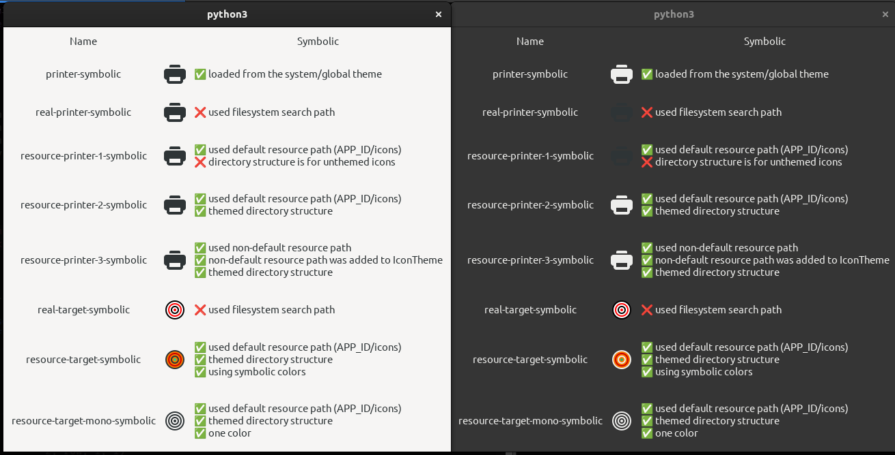

GTK App Icons Test
==================

This is a simple application to test how GTK+ 4.0 behaves when loading symbolic SVG icons.

Programmers usually intend for symbolic icons to be recolored to the text foreground
color, thus adapting to the light/dark theme in use. But this feature is only enabled for
some use cases.




How to make recoloring work
---------------------------

  - The icon filename must be `*-symbolic.svg`.

  - The icon must be packaged inside a `.gresource` file.

  - The icon must be placed in a directory called `scalable/CONTEXT` where `CONTEXT` is
    one of the context directories listed in the [Icon Naming
    Specification](https://specifications.freedesktop.org/icon-naming-spec/icon-naming-spec-latest.html):

    - `scalable/actions/`
    - `scalable/animations/`
    - `scalable/apps/`
    - `scalable/categories/`
    - `scalable/devices/`
    - `scalable/emblems/`
    - `scalable/emotes/`
    - `scalable/intl/`
    - `scalable/mimetypes/`
    - `scalable/places/`
    - `scalable/status/`

  - The `.gresource` file must be loaded and registered:

```python
    resource = Gio.Resource.load(base_path + "/icons.gresource")
    Gio.resources_register(resource)
```

  - When using `GtkApplication`, the application ID is used to derive a default search
    path, `APP_ID/icons`. For instance, if the application ID is `org.gtk.app_icons_test`,
    this resource path would work:

    - `/org/gtk/app_icons_test/icons/scalable/emotes/foo-symbolic.svg`

    When using different paths, you need to manually tell the `IconTheme` to search in it:

    ```python
    theme = Gtk.IconTheme.get_for_display(Gdk.Display.get_default())
    theme.add_resource_path("/some/random/path")
    ```

    Then this would also work:

    - `/some/random/path/scalable/emotes/foo-symbolic.svg`

  - If the icon has only one color, the recoloring is as expected, it is replaced by the
    foreground color. If it has multiple colors, they will all receive the foreground
    color. GTK+ understands three symbolic colors: `success`, `warning` and `error`. The
    SVG elements must have `class="success"`, `class="warning"` or `class="error"` for
    these colors to be used. See the
    [icons/real-target-symbolic.svg](icons/real-target-symbolic.svg) for an example.
